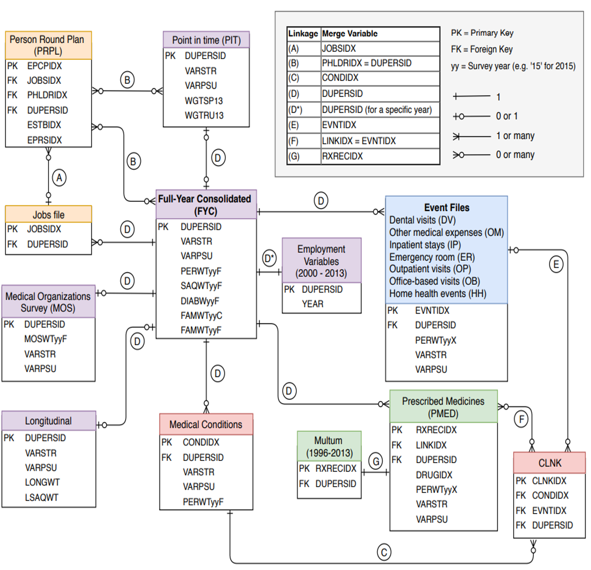

__Multiple Sclerosis (MS)__, a chronic and debilitating inflammatory autoimmune disorder of the central nervous system, afflicts approximately __900,000 people__ in the United States and __2.1 million people__ worldwide.

Because patients with MS typically have a long-life span and increased healthcare utilization, MS imposes a significant burden on patients and their families/caregivers, employers, and the healthcare system.

__Three questions to ask:__
1. What factors are significant in predicting MS?
2. Can we predict which patients are diagnosed with MS?
3. Is the out-of-pocket costs associated with MS?

## 1. Understanding dataset

[Medical Expenditure Public Survey Dataset (MEPS)](https://www.meps.ahrq.gov/mepsweb/) was used as a main dataset.
This dataset is known to be the most complete source of data on the cost and use of health care and consist of a set of large-scale surveys of families and individuals, their medical providers, and employers across the United States.

## 2. Data exploration and preprocessing

## 3.

## 4. Discussion and future work

## 5. Takeaway
